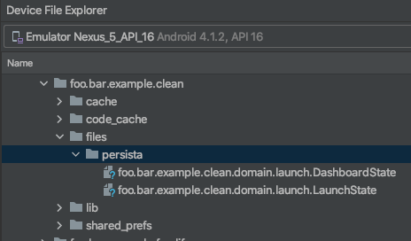
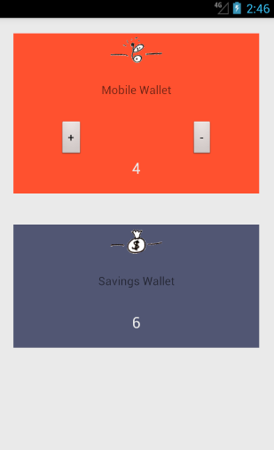

# PerSista

[](https://github.com/erdo/persista/blob/main/LICENSE.txt)


[](https://circleci.com/gh/erdo/persista/tree/main)

<br/>

Small library for persisting _single instances_ of kotlin data classes. It's particularly useful as a way to asynchronously persist immutable state.

```
val state = DashboardState(dashboardId = 777, userName = "erdo")

perSista.write(state)
perSista.read(default = state)

// or from outside a coroutine scope
perSista.write(state){ savedState ->  }
perSista.read(default = state){ readState ->  }

```

## Positives
- pure Kotlin so can be used in non-android modules
- coroutine based
- very simple API
- tiny (<200 lines of code)

## Restrictions
- can only save one instance per data class: write a second instance of the same class, it will just overwrite the previous one
- not suitable for enormous data classes, hard limit of 2 GB per instance

## How to get it

Copy the PerSista.kt class into your own app and edit as appropriate, or add this gradle line to your project (you'll need mavenCentral() in your list of maven repos)

```
implementation("co.early.persista:persista:1.1.0")
```
PerSista 1.0.0 and above requires kotlin 1.6 and above. (PerSista uses kotlin's _typeOf_ internally which was marked as experimental prior to kotlin 1.6 - previous versions of PerSista which are also marked as experimental accordingly can be used for earlier versions of kotlin: e.g. PerSista 0.2.3)

## How to use it

Construct PerSista with the folder you want your data saved to, for an android app you'll probably want to use Application.getFilesDir(). Typically you will share this single PerSista instance, just use some form of DI (manual or otherwise) to get it wherever it's needed.

```
val perSista = PerSista(application.filesDir)

```

Define your data class, mark it serializable (also don't forget to add the kotlin serialization plugin to gradle)

```
@Serializable
data class DashboardState(
    val dashboardId: Int = 0,
    val userName: String,
    val drivers: List<Driver> = emptyList(),
    val error: Error? = null,
    @Transient val isUpdating: Boolean = false
)

@Serializable
data class Driver(
    val driverId: Int,
    val driverName: String,
    val powerLevel: Int,
    val lat: Int,
    val long: Int
)
```

Save an instance like this:

```
val state = DashboardState(dashboardId = 777, userName = "erdo")

// from inside a coroutine scope
perSista.write(state)

// from outside a coroutine scope
perSista.write(state){ savedState ->
}
```

Read an instance like this:
```
val defaultState = DashboardState(userName = "defaultUser")

// from inside a coroutine scope
val state = perSista.read(defaultState)

// from outside a coroutine scope
perSista.read(defaultState){ readState ->
}
```

## How it works

PerSista uses Kotlin's built in Serialization to turn data classes into json. Because it needs to accept any data class you might throw at it, it depends on typeOf() internally to work out the class type of the item

PerSista prioritizes correctness over performance, all the reads and writes are guaranteed to be done sequentially as they are performed using a coroutine dispatcher created from a single-threaded Executor (though you can override that if you want)

## Data storage

Persista writes the json representation of the data class to the file system, the example above would generate a file called com.example.DashBoardState with this content:

```
{"dashboardId":777, "userName":"erdo"}
```

You can browse the files that are saved on an emulator using Device Explorer in Android Studio (View -> Windows -> Device File Explorer), for an android device they will typically be in: data/data/your.app.package/files/persista



## Error handling

It's up to you to ensure that you only pass something which is serializable to the write method. Because typeOf() is one of those things that behaves differently depending on which kotlin platform you are running on, I've taken a conservative approach, and in the worst case scenario when using PerSista if the write() fails: nothing will happen, if the read() fails: you will receive the default value. Pass a logger in to the constructor if you want to see more detail about what happened.

If you DO want to receive exceptions (during development for instance) pass 'strictMode = true' to the constructor, in that case, the only time you still won't receive an exception when something goes wrong is when an attempted read fails because it can't find the file (that's most likely because a write was never performed in the first place).

## Performance
Performance is "ok". On a 2017 Pixel XL, PerSista seems to have a setup overhead of around 400ms the first time it writes, after that a small instance of a data class takes around 2-30ms to store, but importantly **none of the IO is run on the UI thread anyway** so your UI won't be blocked and you won't see any jank.

## Versioning
PerSista has no concept of data class versioning, so if you change the definition of your data class (due to an app upgrade for instance) and kotlin serialization is no longer able to decode the old json to the new data class, you will just get your default value back.

## Obfuscation
**The same advice applies here as would apply to any strategy that uses class names for serialization**. The state of your data class will be saved in a file named after the data class's qualified name e.g. "foo.bar.app.DashboardState". If that data class gets obfuscated however, the qualified name could easily be renamed to something like "a.b.c.a". If you release a new version of the app, this time the qualified name could be renamed to "b.c.d.d" and PerSista will consider that a new class. Check the example app's proguard configuration if you want to prevent this behaviour (it's the same as what you are probably already doing to use ktor).

## Permissions
None required on Android, as long as you stick to the internal app directory: `Application.getFilesDir()`

## Example App



There is a complete mini example android app in this repo if you need something to copy-paste to get started.

## Anything else
The non-suspend APIs invoke a functional parameter when they are complete, if you are using PerSista on Android this will arrive on the main thread. For non UI kotlin platforms (which don't have a Dispatchers.Main) you should override the mainDispatcher parameter in the constructor to an available dispatcher of your choice.

## License

    Copyright 2015-2022 early.co

    Licensed under the Apache License, Version 2.0 (the "License");
    you may not use this file except in compliance with the License.
    You may obtain a copy of the License at

       http://www.apache.org/licenses/LICENSE-2.0

    Unless required by applicable law or agreed to in writing, software
    distributed under the License is distributed on an "AS IS" BASIS,
    WITHOUT WARRANTIES OR CONDITIONS OF ANY KIND, either express or implied.
    See the License for the specific language governing permissions and
    limitations under the License.
